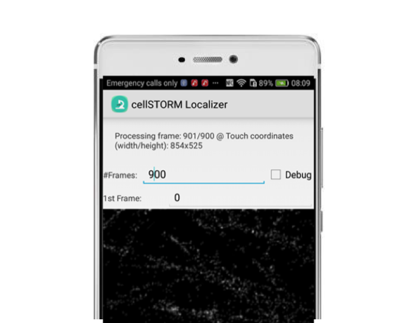

cellSTORM Android APP
==============================

Based on paper by Benedict Diederich, Patrick Then, Alexander Jügler, Ronny Förster, Rainer Heintzmann

[Arxiv-Link](https://arxiv.org/abs/1804.06244)

## Installation
The APP should work on newer phones. Tested devices include a Sony Xperia X5 and Huawei P9+P20 pro. To process the data, please download the .PB (protobuf) file containing thhe pretrained Neural Network. 

The files are available in our [GoogleDrive]([https://drive.google.com/drive/folders/1dc1n7xVqvl5wu0Mui3TbSOfZdSqgrVZJ?usp=sharing)

## Processing of the Videos
We tested the APP with a MP4-files acquired using the Huawei P9 with t_exp=30ms at ISO=3200 on the monochromatic sensor. We support some video files from experiments where we recorded Microtubulines in our standard dSTORM setup. Please have a look in our [GoogleDrive]([https://drive.google.com/drive/folders/1dc1n7xVqvl5wu0Mui3TbSOfZdSqgrVZJ?usp=sharing) (attention: Videofile>1GB!). 

The APP should be self explanatory. Select the video (e.g. from /Downloads/) and process the file. Depending on the phone, processing usually takes usually 200-300ms per frame (2-3 fps). 
Before you process a video, you have to select the center-coordinates where a region of 64x64 pixels gets cropped out. 

Selecting **DEBUGGING** means that the APP writes out all detected frames to disk before summing it to form the super-resolved image. You can find the frames in the folder /cellSTORM which gets automatically created. 

The **results** can be found in the /cellSTORM folder as well. 

## DISCLAIMER 
The APP will be provided as is whithout any guarantee of correct functionality. It's more a proof-of-principle rather than a working solution. 
If you find any errors, feel free to comment on them or fork the repository to solve the issues. 

